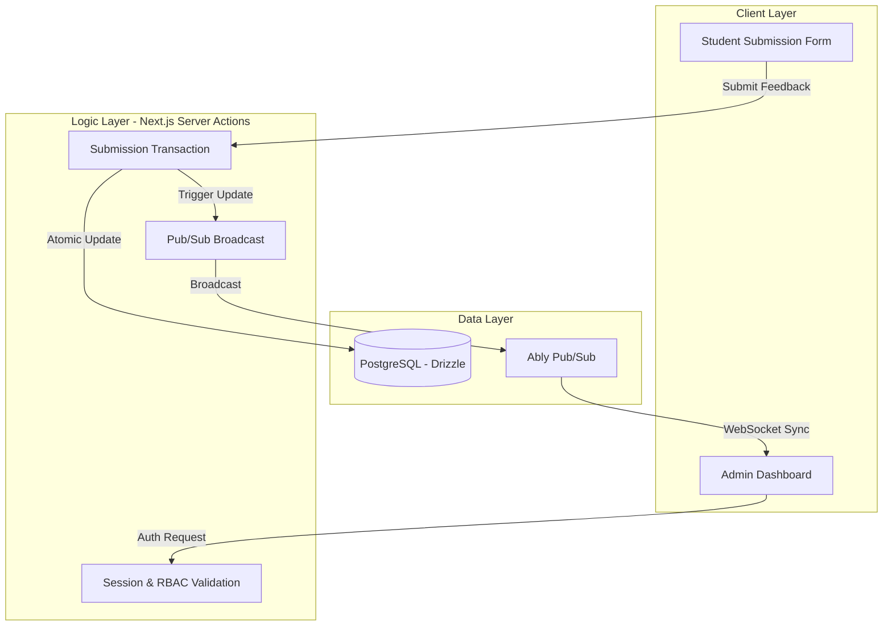
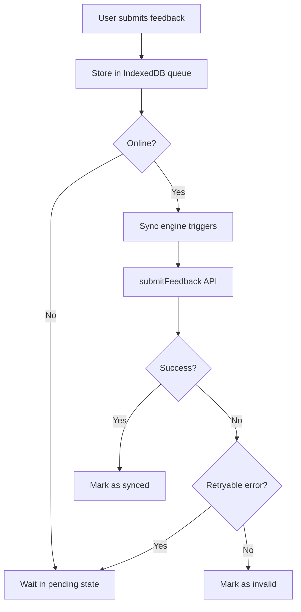

# Secure Feedback Platform

A web-based system for collecting anonymous student feedback using one-time access codes and real-time data synchronization.

[](https://nextjs.org/)
[](https://www.typescriptlang.org/)
[](https://orm.drizzle.team/)
[](https://www.postgresql.org/)

## System Overview

This platform facilitates anonymous feedback collection for educational institutions. It is designed to solve two primary problems: ensuring the integrity of anonymous responses and providing immediate, real-time feedback to administrators.

### Core Engineering Features

*   **Transactional Integrity**: Feedback submissions are processed within database transactions to ensure that an access code is marked as "used" if and only if the response data is successfully recorded.
*   **Real-time Pub/Sub**: Integration with **Ably** allows the admin dashboard to receive sub-second updates as students submit feedback, without polling the database.
*   **Decoupled Data Modeling**: The schema separates feedback instances, course offerings, and faculty members into a normalized structure, allowing for reusable templates and flexible reporting.
*   **End-to-End Type Safety**: Shared TypeScript types across the database schema (Drizzle), server actions, and frontend components reduce runtime errors and improve developer experience.

---

## Technical Stack

*   **Framework**: Next.js 15 (App Router) with React 19 Server Components.
*   **Authentication**: Better Auth (supporting Role-Based Access Control).
*   **Database**: PostgreSQL hosted on Neon, managed via Drizzle ORM.
*   **Real-time**: Ably (WebSocket-based Pub/Sub).
*   **Reporting**: jsPDF for client-side report generation.
*   **Styling**: Tailwind CSS 4.0.

---

## System Architecture

The application follows a **Modular Monolith** pattern, leveraging Next.js Server Actions for secure, type-safe communication between the client and the database.



### Data Modeling & Schema
The database schema is designed for normalization and referential integrity:
*   **`feedback_instances`**: Represents a single feedback session (e.g., "Semester 1 Feedback").
*   **`course_offerings`**: Reusable course definitions linked to evaluation templates.
*   **`student_access_codes`**: Unique identifiers generated per instance to control access and ensure one-time usage.
*   **`feedback_submissions`**: Transactional records linking an access code usage to a specific instance.
*   **`feedback_responses`**: Normalized storage for individual question ratings.

## Offline-First Submission & Sync System

The platform implements an **offline-first feedback submission pipeline** to ensure that student responses are never lost due to network instability.

When a user submits feedback, the system does not immediately rely on network availability. Instead, responses are first persisted locally and later synchronized with the server.

### Key Design Principles

- **Local-first writes**: Every feedback submission is immediately stored in IndexedDB using Dexie.
- **Eventual consistency**: Server synchronization happens asynchronously when connectivity is restored.
- **Failure isolation**: Network or server errors do not block local submission.
- **Explicit state tracking**: Each queued submission has a lifecycle state (`pending`, `synced`, `invalid`).

---

### Offline Queue Architecture



---

### Sync Triggers

The sync engine runs automatically on:

- Application load  
- Browser `online` event  
- Window focus  
- Tab visibility change  

This ensures that queued feedback is eventually delivered without user intervention.

---

### Error Handling Strategy

Server responses are normalized into structured error codes (`FeedbackErrorCode`) and handled as follows:

- **Retryable errors** (`INTERNAL_ERROR`, `INACTIVE_INSTANCE`)
  - Keep item in `pending` queue for future retry

- **Non-retryable errors**
  - Mark as `invalid` to prevent repeated failed attempts

- **Success**
  - Mark as `synced` and remove from retry loop

---

### Reliability Guarantees

This system ensures:

- No feedback loss during offline usage
- No duplicate submissions via unique access code constraint
- Automatic recovery without user involvement
- Consistent eventual sync behavior across sessions

---

### UX Behavior

- Users can submit feedback without internet connectivity
- A local confirmation is shown immediately
- Sync status is handled silently in the background
- Toast notifications summarize sync results (success/failure counts)

### Security Design
1.  **Access Control**: Administrative routes are protected via server-side session validation.
2.  **Anonymization**: Submissions are decoupled from student identities. While an access code proves authorization, it is not linked back to a user profile in the database.
3.  **One-Time Use**: The system enforces a strict "claim-and-consume" logic within a transaction to prevent replay attacks or multiple submissions with the same code.

---

## Development & Deployment

### Prerequisites
*   Node.js 20+
*   pnpm
*   PostgreSQL (Neon recommended)

### Setup

1.  **Install dependencies**
    ```bash
    pnpm install
    ```

2.  **Environment Variables**
    Configure `.env` with the following:
    ```env
    DATABASE_URL="your_postgres_url"
    BETTER_AUTH_SECRET="your_secret"
    BETTER_AUTH_URL="http://localhost:3000"
    ABLY_API_KEY="your_ably_key"
    NEXT_PUBLIC_ABLY_API_KEY="your_ably_key"
    ```

3.  **Database Migration**
    ```bash
    pnpm db:generate
    pnpm db:migrate
    ```

4.  **Run Development Server**
    ```bash
    pnpm dev
    ```

---

## Roadmap

*   **Testing**: Implementation of Playwright for end-to-end testing of the submission flow.
*   **Analytics**: Historical trend analysis for faculty performance.
* **AI-Assisted Insights**: Automated clustering and summarization of qualitative feedback to identify recurring concerns and trends.
*   **DevOps**: GitHub Actions for automated linting and schema validation.

---
## License
MIT License.